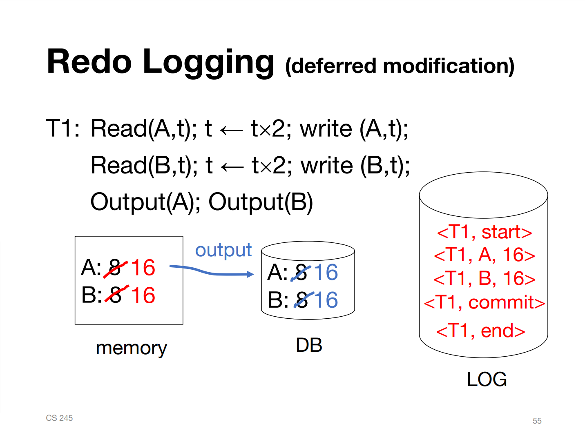

**Replicating gradescope tests locally**

The code can be compiled using Maven; the following command generates a jar file
for the entire project,

```bash
mvn package
```

You can simulate what the grader machines will do by running the autograder
script as follows:

```bash
java -Xmx1536m -Xms1536m -jar target/tests.jar 
```

This will output a json file that should match the graded tests run on
gradescope.

**Submitting your solution**

Run 
```bash
create_submission.sh
```

This will create a file student_submission.zip that you should upload to
gradescope.

Alternatively, just make a zip file containing **only** TransactionManager.java
with no directory structure and upload that.

**Teaching Staff Autograder Setup**

Create Autograder files and upload zip archive to Gradescope.

```bash
bash make_autograder.sh
```


## 实现思路

采用的Commit Logging这种事务的实现方式，在《凤凰架构》的[本地事务](https://icyfenix.cn/architect-perspective/general-architecture/transaction/local.html)这一节里边也有提到。简单来说：

> 所有对数据的真实修改都必须发生在事务提交以后，即日志写入了 Commit Record 之后。

我的实现中，用`LogRecord`对象来表示一行日志记录，记录的类型其实只需要两种，一种是写操作（**`OPS`**）；另一种是提交操作（**`COMMIT`**），表示整个事务已经完成持久化。对于读操作是不需要开启事务的，因为返回的是`latestValues`中的值，而更新其中的值是确保在事务完成提交之后：

> Returns the latest **committed** value for a key by any transaction.（来自`TransactionManager#read()`注释）

代码实现当中比较重要的是`commit()`和`initAndRecover()`，分别代表提交和崩溃恢复。我在实现`writePersisted()`过程中费了不少功夫，后边看了[这个仓库](https://github.com/hahabigzoo/cs245-as3)中对这个部分的实现才有了思路。

##### 总流程

首先得明确事务的持久化过程，在这个课程的[PPT](https://web.stanford.edu/class/cs245/slides/10-Transactions-and-Recovery.pdf)中有详细的描述。简单来说：1️⃣ start；2️⃣ 写记录；3️⃣ commit，表明这个事务成功落盘，完成了持久化(persist)。整个过程是**顺序追加**写入磁盘文件的，这是比较高效的写磁盘的方式。完成上边三步并不意味着这个事务圆满完成了，此时事务中的操作还没有被应用(apply)到数据库中，即没有真正修改具体的数据。apply过程不要求实现，在`StorageManager`中已经提供好了，但会在apply后回调`writePersist()`，这是需要实现的。



##### 编码 解码

因为日志（log）在`LogManager`中是以byte数组(`byte[]`)的形式持久化的，所以编码、解码日志信息稍微有一点点麻烦。首先需要知道持久化`LogRecord`中的字段以及这些字段的大小，因为`LogRecord`实例有两种类型，对于`COMMIT`类型，不会有key和value两个值，但为了处理方便，在创建`COMMIT`类型的`LogRecord`实例时，我为这两个字段设置了缺省，这样在编/解码时就不存在空指针异常了。

第二个需要注意的点是在崩溃恢复(`initAndRecover()`)时，需要读取并解码`LogRecord`，则需要确定每一个记录的**边界**，也就是每一个`LogRecord`的size。我直接把这个值存放在每一个记录对应的`byte[]`的最开始的四个字节。这是我能想到的最简便的方式，我看到别的实现中要进行移位感觉稍微有些复杂。

##### 实现`commit()`

接下来说说重头戏`commit()`（提交事务）和`initAndRecover()`（崩溃恢复）。`commit()`的思路比较直白，可以细分为两个子过程，*persist* 和*apply*。persist过程是将整个事务日志持久化，首先为该事务（如T1）写下`<T1,commit>`（即[commit record](https://icyfenix.cn/architect-perspective/general-architecture/transaction/local.html#:~:text=%E6%95%B0%E6%8D%AE%E5%BA%93%E5%9C%A8%E6%97%A5%E5%BF%97%E4%B8%AD%E7%9C%8B%E5%88%B0%E4%BB%A3%E8%A1%A8%E4%BA%8B%E5%8A%A1%E6%88%90%E5%8A%9F%E6%8F%90%E4%BA%A4%E7%9A%84%E2%80%9C%E6%8F%90%E4%BA%A4%E8%AE%B0%E5%BD%95%E2%80%9D%EF%BC%88Commit%20Record%EF%BC%89%E5%90%8E%EF%BC%8C%E6%89%8D%E4%BC%9A%E6%A0%B9%E6%8D%AE%E6%97%A5%E5%BF%97%E4%B8%8A%E7%9A%84%E4%BF%A1%E6%81%AF%E5%AF%B9%E7%9C%9F%E6%AD%A3%E7%9A%84%E6%95%B0%E6%8D%AE%E8%BF%9B%E8%A1%8C%E4%BF%AE%E6%94%B9)，如上图），然后将整个事务落盘。“写下`<T1,commit>`”是非常关键的步骤，在崩溃恢复时，判断哪些日志需要恢复的依据就是这一条记录，拥有这一条记录的事务才能被认为需要被恢复的。

persist子过程中，调用`LogManager#appendLogRecord()`会返回在添加这条记录之前日志的长度，换句话说，就是这条记录在日志中的**起始位置**（以下称为offset），这个值会被作为`TaggedValue`中的tag，也就是每一个value都会有一个tag，我觉得这实际上是为每一个key对应的value加上一个版本。因为看了`StorageManagerImpl`的源码会发现其实为一个key更新了一个value后旧的value是不会被删除的，而是被保留在**版本链**上。对这个版本链上的各个value做区分的方式就通过tag，而用offset作为tag的好处在于，越新的版本会越后写入log，对应的offset值就越大。

apply子过程除了更新数据库以外（`StorageManager#queueWrite()`），还需要更新`latestValues`，注意这个过程是一定要在persist子过程之后发生，以确保这些数据已被持久化。

##### 实现`initAndRecover()`

`initAndRecover()`的实现最重要的是`committedTxn`变量，用来记录哪些事务需要做恢复的。依据是：一个记录（`LogRecord`实例）的类型是`COMMIT`，那么这个记录对应的事务就需要被恢复。有种情况也是有可能发生的：假如一个事务有7个写入操作，即7个`LogRecord`实例，在只apply了前三个后发生崩溃，在恢复的时候因为这个事务还有`COMMIT`记录在日志（log）中，此时还会接着恢复剩下的4个记录，也就是说，存在一个事务一部分被commit并apply了，而一部分没有的情况。这种情况应该没啥问题，因为Commit Logging这种事务实现方式（准确是是原子性和持久性实现方式），是不会在commit之前真正修改数据的，并不像WAL（write ahead logging），会在commit之前就对数据信息了修改。

##### 实现`writePersisted()`

`writePersisted()`实现是我纠结最久的地方，核心问题是什么时候truncate log？我最开始的思维非常粗暴，只要`persisted_tag`参数的值是大于`LogManager`的`logTruncationOffset`属性就可以，这样的做法有个很明显的问题：更新数据库中的值（apply过程）是**并发**的，也就是说，tag值高的（也即offset值高的），有可能会先于tag值低的被apply到数据库中，这种情况下，**低tag值的log record会在还没有确保被apply之前就被truncate掉**（`logTruncationOffset`>该record的tag值），在数据库没有崩溃是还好，但崩溃恢复时只会从`logTruncationOffset`开始加载record，这时便不可能恢复到这个record了。最后的实现思路是参考了[这个仓库](https://github.com/hahabigzoo/cs245-as3)，确保被truncate的offset是**由小到大**进行的。
